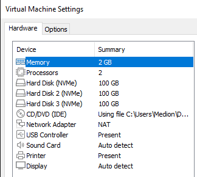
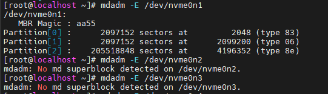
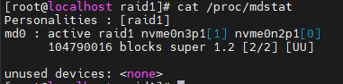
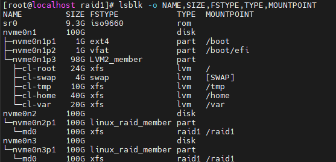

RAID 1 azaz tükrözés kialakítása centos 8 alatt.

A következőkben egy szoftveres RAID1 létrehozásának lépéseit mutatom be Centos 8 rendszeren, mdadm használatával.

Kiindulási állapot:

VMware virtuális környezetben: Centos 8 op.rendszer, 2 GB memória, 2 mag és 100 GM fő merevlemez (NVMe típus). Ez mellé kerül be két azonos paraméterű merevlemez, azonos méretekkel (100-100 GB).

Disk-ek neve:

/dev/nvme0n1

/dev/nvme0n2

/dev/nvme0n3

\1. lépés: Az előfeltételek telepítése és a meghajtók vizsgálata

Az mdadm-et használjuk a RAID létrehozásához és kezeléséhez, ezért amennyiben még nincs telepítve telepíteni kell. Telepíteni az alábbi paranccsal lelet:

yum install mdadm

Vizsgálja meg mindkét meghajtót, hogy vannak-e RAID konfigurációk. Ennek azt kell mutatnia, hogy nincs md szuperblokk észlelve.

mdadm -E /dev/nvme0n2

mdadm -E /dev/nvme0n3

Amennyiben nincs a vissza adott érték a fenti kép szerinti No, azaz nemleges értéked adja vissza. Ezek alapján következhet a 2. lépés.

\2. lépés: Mindkét meghajtó particionálása RAID számára

RAID 1 létrehozásához legalább 2 partícióra van szükségünk Ehhez létre kell hozni a partíciókat a csatol merevlemezeken fdisk segítségével, továbbá a partíció létrehozása során változtassuk meg a típust RAID-re.

Partíciók kialakítása:

/dev/nvme0n2 esetében:

fdisk /dev/nvme0n2

Majd a következő utasítássort kell kiadni:

Új partíció létrehozásához nyomja meg az 'n' billentyűt.

Nyomja meg a 'p' gombot az elsődleges partíció kiválasztásához.

Nyomja meg az '1' gombot a partíció számának 1 kiválasztásához.

Használja az alapértelmezett kezdő és záró szektort az Enter billentyű kétszeri megnyomásával. Ez a partíció teljes meghajtóját fogja használni.

Ezzel el is készül a partíció, most már csak a típust kell módosítani.

Nyomja meg a 't' gombot a partíció típusának módosításához.

Nyomja meg az „fd” billentyűt a Linux Raid Auto kiválasztásához.

Nyomja meg a 'p' gombot a partíciós tábla kinyomtatásához.

Nyomja meg a 'w' billentyűt a változtatások lemezre írásához.

Miután elkészítetted a /dev/nvme0n2-t a fenti beállításokat a /dev/nvme0n3-n is el kell végezni.

/dev/nvme0n3 esetében:

\3. lépés: RAID1-eszközök létrehozása

Ezután létrehozzuk a /dev/md0 nevű RAID1 eszközt a következő paranccsal

mdadm --create /dev/md0 --level=1 --raid-devices=2 /dev/nvme0n2p1 /dev/nvme0n3p1

A fenti parancsban az ’mdadm –create’ résszel a tömb létrehozását adjuk ki, ezt követni a létrehozni kívánt eszköz nevét (jelen esetben /dev/md0), a RAID szintjét (--level=1), számát (--raid-devices=2) és az eszközöket (/dev/nvme0n2p1 /dev/nvme0n3p1) adjuk meg.

Ha a használt összetevő eszközök nem engedélyezettek a bootjelzővel rendelkező partíciók, akkor valószínűleg a következő figyelmeztetés jelenik meg. A folytatáshoz nyugodtan írja be az y -t.

Ezután a következő parancsokkal ellenőrizheti a RAID-eszközök állapotát

mdadm --detail /dev/md0

\4. lépés: Fájlrendszer létrehozása a RAID-eszközön

Hozzon létre fájlrendszert az xfs használatával a /dev/md0 fájlhoz:

mkfs.xfs /dev/md0

Csatlakoztassa az újonnan létrehozott fájlrendszert a /raid1 alatt, és próbáljon meg néhány fájlt létrehozni:

mkdir /raid1 

mount /dev/md0 /raid1 

touch /raid1/raid\_test.txt 

echo "RAID 1 test" > /raid1/ raid\_test.txt

Abban az esetben, ha szeretnénk, hogy a RAID1 automatikus csatlakoztatásához a rendszer indításakor hozzá kell adnia az alábbi sort az /etc/fstab aljához:

nano /etc/fstab

/dev/md0 /raid1 xfs defaults 0 0

Ezzel elkészült a RAID 1 tárolási eljárás kialakítása. Viszont hogyan ellenőrizhetjük az állapotát?

Egyik lehetőség a /proc/mdstat ami egy speciális fájl. Alapvető információkat tárol az összes jelenleg aktív RAID-eszközről

A fenti képen 

md0 - RAID eszköz fájlneve

active raid1 – RAID típus

nvme0n3p1[1] nvme0n2p1[0] – az md0nevű RAID 1 eszköz, amely kettő partícióból áll

[UU] – A raid tag lemez/partíció egyes eszközeinek állapotát mutatja. Az „U” azt jelenti, hogy az eszköz egészséges és működőképes. A „\_” azt jelenti, hogy az eszköz leállt vagy sérült.

A részletesebb adatokhoz a következő parancsot kell kiadni:

mdadm --detail /dev/md0

A disk-ek kialakítását a ’lsblk -o NAME,SIZE,FSTYPE,TYPE,MOUNTPOINT’ parancs után nézhetjük meg:

Források:

<https://linuxscriptshub.com/configuring-software-raid-1-in-centos-7/>

MDADM and LVM cheat sheet: <https://gist.github.com/plepe/52ecc9f18efb32c68d18>

Több RAID típus kialakítása: <https://www.digitalocean.com/community/tutorials/how-to-create-raid-arrays-with-mdadm-on-ubuntu-16-04>

https://www.cyberciti.biz/faq/how-to-check-raid-configuration-in-linux/
